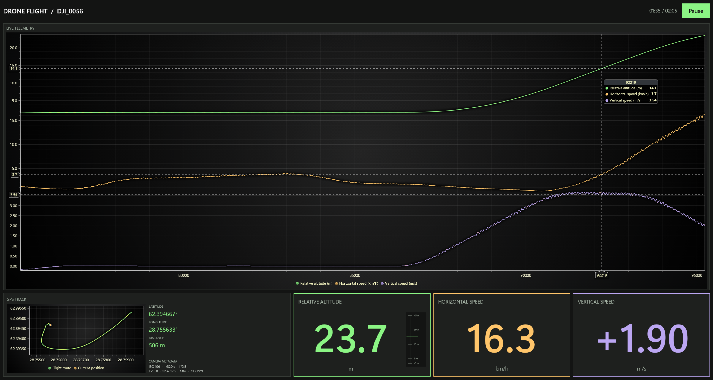

# LightningChart for Uno Platform

This Uno Platform example replays a drone flight from `examples/data/drone_data_timestamp_added.CSV`. Two WebViews display the charts: a telemetry chart shows altitude, horizontal speed, and vertical speed, and a route chart shows the flight path reached so far and the drone's current position. The KPI cards display the current measurements, GPS coordinates, distance, and camera metadata.

Learn more: [LightningChart documentation](https://lightningchart.com/lc-la/docs/)



## Run

1. Install the .NET 10 SDK. The Windows target requires Windows 10 build 19041 or later and the Microsoft Edge WebView2 Runtime (normally already installed).
2. Get a [free LightningChart JS trial key](https://lightningchart.com/js-charts/docs/licenses/trials/) and set it in PowerShell:

   ```powershell
   $env:LCJS_LICENSE_KEY="your-license-key"
   ```

3. Run the project:

   ```powershell
   dotnet run --project .\LightningChartUnoExample.csproj
   ```

4. Playback starts automatically after both charts initialize. Select **Pause** to pause, then **Play** to resume.
